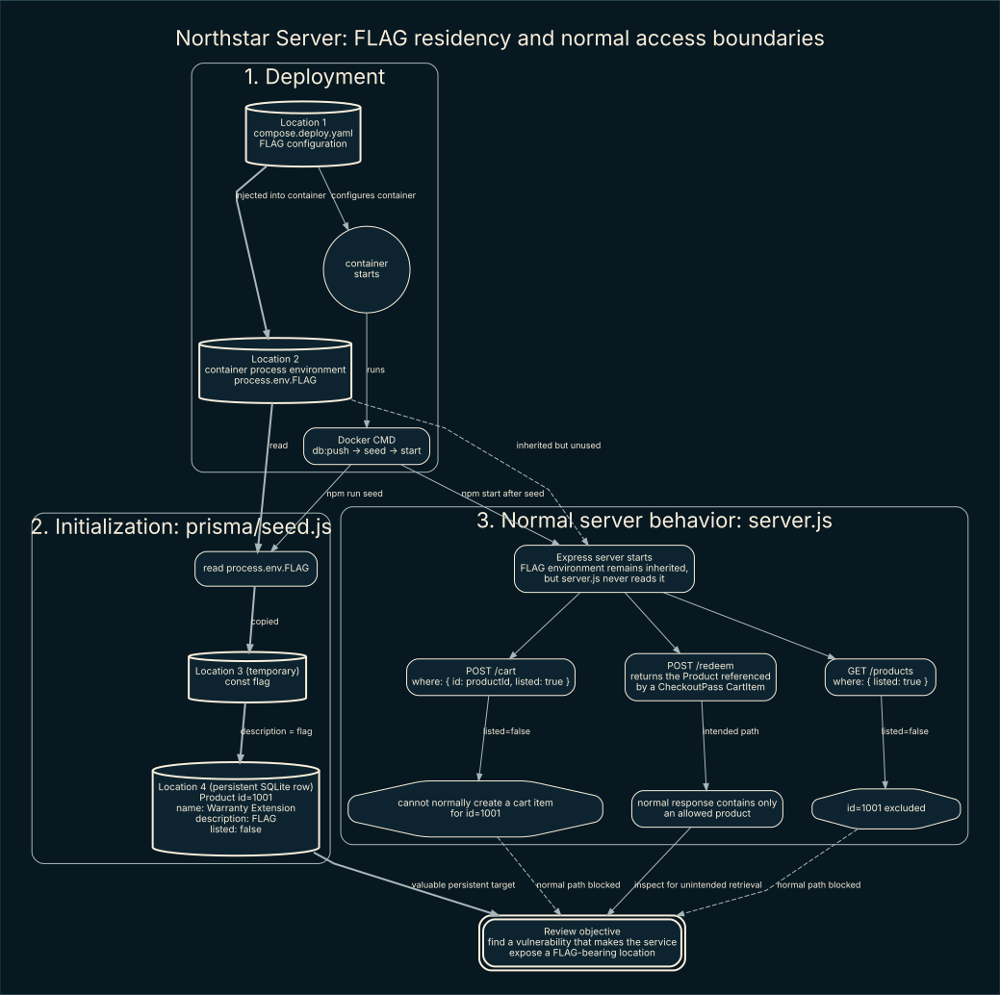
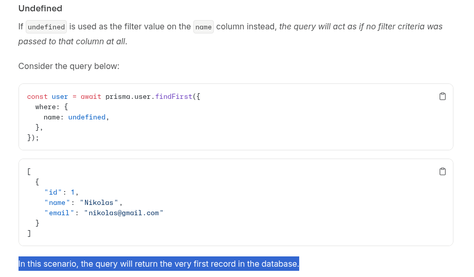
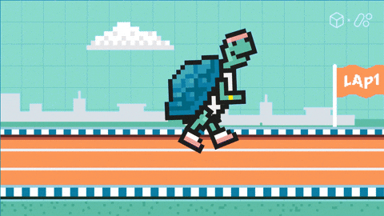

# When the loser takes it all - Northstar CATF 2026 Finals

> Heads-up: this is more than a solve, it includes the full thought process. In the AI era, you can read it, challenge it, or feed it to your agent as a skill.

## TL;DR
We are going to abuse a race condition and a `prisma.findFirst()` edge case inside a tiny timing window created by table relations.

## Takeaway
When I start a simple code review, I like to visualize the code before getting lost in it. For a quick pass, I would go with `Joern`; when I need deeper analysis and proper taint tracking, I would reach for CodeQL. Here is how I generated Joern's raw per-function PDGs:
```bash
joern-parse ./server.js --output cpg.bin
joern-export --repr pdg --format dot --out joern-graphs cpg.bin
mkdir -p joern-images
for graph in joern-graphs/*.dot; do
  dot -Tsvg "$graph" -o "joern-images/$(basename "${graph%.dot}").svg"
done
```
> You can use the same approach on a large codebase, but split it into smaller targets first or the output will quickly turn into graph soup.

Btw the visualization did not solve this chall for me. I just wanted to share a trick that might be new to a lot of readers.

## Introduction
Let's start by following the flag. At container startup, Docker Compose injects it through the `FLAG` environment variable. The startup command runs the Prisma seed before launching the server, and `prisma/seed.js` copies the value into the `description` of product `1001`, **Warranty Extension**. That product is then stored in SQLite with `listed: false`.



From here, we have two ideas: attack the persistent copy in SQLite, or catch the flag in memory while it moves from the environment into the database. The second idea sounds cool, but we have no interface to the server during that transfer, the HTTP server starts only after seeding finishes. The server process still inherits the environment, but `server.js` never reads `process.env.FLAG`, so there is no direct HTTP data-flow path to it either.

### Flag locations and attack surface

That leaves the database copy as our practical target. To keep the attack surface clear, the flag lives in two relevant places:

1. **Environment variable:** we might reach it through an information disclosure, an arbitrary local-file read/LFI that can expose a process environment, or RCE.
2. **Database:** the flag sits in the hidden product's `description`. Here I would look for unsafe raw SQL, broken access control, incorrect query construction, ORM edge cases, and races between related operations.

I will leave the environment path for your own research and follow the database path here. The application does not use raw SQL, so classic SQL injection is not our immediate direction.

Let's ignore the database functions whose parameters are not dynamically evaluated from request-controlled input or mutable application state. We cannot steer them directly through the HTTP interface, so staring at them will not get us far. Instead, I care about calls whose `where`, `data`, or relation fields depend on values such as `productId`, the decoded `passId`, or records returned by earlier queries. I will still keep static-looking writes in scope when they can change shared state that a later dynamic query reads.

After that bit of ignorance, `product.findMany()` in `GET /products` drops out because both its filter and selected fields are static. Our shortlist becomes:

- `product.findFirst()`, whose filter receives either the request's `productId` or `details.cartItem?.productId` from an earlier relational query.
- `checkoutPass.findUnique()`, whose filter receives the JWT's decoded `passId`. Prisma replaced the old `findOne` operation with [`findUnique`](https://docs.prisma.io/docs/orm/v6/reference/prisma-client-reference#findunique) in version 2.12.0.
- `checkoutPass.create()`, which creates a pass and related cart item using the selected `product.id`.
- `cartItem.deleteMany()`, which deletes a relation using `details.cartItem.id`.
- `redemptionLog.create()` and `checkoutPass.update()`, which both use the decoded `passId` and mutate shared redemption state.

Do not throw away the writes just because they do not return the flag themselves. Changing one related record can change what a later read sees. Under normal behavior, the application protects the flag-bearing row: `GET /products` returns only listed products, while `POST /cart` requires both the requested ID and `listed: true`. So I am going to follow product IDs, checkout passes, and related records across every Prisma read and write until something reaches the response.

The goal is simple: make one of those operations retrieve and serialize the hidden product's flag-bearing `description`. The diagram stops at that objective on purpose; now let's figure out how to reach it.

### Fuzzing the Prisma boundary with AFL++

For me, the next move is to fuzz each of those functions for edge cases while reading its documentation. That second part matters because I need to know whether I found a vulnerability or just normal ORM behavior. Also, a crash-only campaign is not enough here: the interesting failure may return a perfectly valid but unauthorized row without crashing Node.js. So the harness defines security rules and calls `process.abort()` when one is broken, which gives AFL++ something it can save as a crash.

These are the rules I care about:

- A lookup must not return hidden product `1001` unless that ID was explicitly requested.
- `findUnique` must not return a checkout pass with a different ID.
- Nested `create` must preserve the requested product relationship.
- Deleting a cart item must leave the optional checkout-pass relation in the expected state.
- Logs and updates must remain attached to the requested `passId`.
- A checkout pass created for a visible product must never resolve to an unlisted product after a sequence of relation changes.

A normal AFL++ compiler cannot instrument JavaScript source directly. To get feedback from Node/V8, run the target through AFL++ [FRIDA mode](https://github.com/AFLplusplus/AFLplusplus/blob/stable/frida_mode/README.md) with `-O`, then enable JIT-generated-code instrumentation with [`AFL_FRIDA_INST_JIT=1`](https://github.com/AFLplusplus/AFLplusplus/blob/stable/docs/env_variables.md). Before burning an hour on a campaign, make sure your AFL++ build actually includes FRIDA support.

I would smoke-test one harness target first:

```bash
FUZZ_TARGET=findFirst \
  node fuzz/prisma-harness.js fuzz/corpus/seed
```
Once coverage looks sane, run a separate time-bounded campaign for each target:
```bash
for target in findFirst findUnique create deleteMany createLog update sequence; do
  FUZZ_TARGET="$target" \
  AFL_FRIDA_INST_JIT=1 \
    afl-fuzz -O -V 3600 -m 0 -t 5000+ \
      -i fuzz/corpus \
      -o "fuzz/out/$target" \
      -x fuzz/afl-prisma.dict \
      -- node fuzz/prisma-harness.js @@
done
```

The per-function campaigns explore malformed IDs, missing values, weird types, absent relations, and constraint failures. Do not skip `sequence`: a read can be safe on its own and become dangerous only after a write changes a related row. Finally, replay every AFL++ finding and compare it with Prisma's documentation. A validation error or documented behavior is not automatically a vulnerability; a reproducible break in one of our security rules is what deserves attention.

### When the docs beat the fuzzer

The fuzzer did not hand me anything useful this time, but reading the docs did:



Here is the fun part: in this Prisma version, a field set to `undefined` is omitted from the query. If `where: { id: value }` receives `undefined`, `findFirst()` stops filtering by `id`. Our query also has `orderBy: { id: "asc" }`, so it returns the lowest-ID product,product `1001`, the one holding our flag.

So the real question is: how can we make `details.cartItem?.productId` evaluate to `undefined`?


Is that even a question, ya 3mad?

Optional chaining gives us `undefined` when `details.cartItem` is `null`. So we need to point to either: Unexistent entry or a delted pne. Pointing the relation at a row that does not exist is not the easy route because the database enforces the foreign key. Deletion is much more fun: the application already deletes the `CartItem` after redemption, and the schema's `onDelete: SetNull` behavior clears the optional relation on `CheckoutPass`. All we need is another request reading that relation right after the deletion.



Yep, it is a race condition, but firing two random requests is not enough to make it reliable.


The useful interleaving looks like this:

1. Two requests redeem the same JWT and both read `checkoutPass.used === false`.
2. Request A reads the related cart item and deletes it.
3. Request B has already passed the `used` check, but reads the details after the deletion, so `details.cartItem` is now `null`.
4. `details.cartItem?.productId` becomes `undefined`; Prisma omits the `id` filter; `findFirst()` returns product `1001`.
5. Request B serializes that product, including its flag-bearing `description`, into the response.

The window is tiny. In my tests, the useful interleaving was around 1 ms locally, while remote request-arrival jitter was roughly 30-40 ms. Those are observations from my setup, not guaranteed timings. Sometimes network jitter lands the requests in exactly the right order for free, and that is where **the poorer takes it all**.

With unsynchronized requests, I saw roughly a 1% success rate. Releasing the workers together and tuning the timing pushed it close to 99% in my environment; your numbers will depend on scheduling, database latency, and network conditions.

## Solver
```python
#!/usr/bin/env python3

import json
import threading
from concurrent.futures import ThreadPoolExecutor, as_completed
from urllib.request import Request, urlopen


def post(path, body):
    request = Request(
        f"http://127.0.0.1:18080{path}",
        data=json.dumps(body).encode(),
        headers={"Content-Type": "application/json"},
        method="POST",
    )
    return urlopen(request, timeout=15).read().decode()


def main():
    for attempt in range(1, 6):
        print(f"[*] Race attempt {attempt}/5")
        token = json.loads(post("/cart", {"productId": 2001}))["token"]

        barrier = threading.Barrier(20)

        def redeem():
            barrier.wait()
            return post("/redeem", {"token": token})

        with ThreadPoolExecutor(max_workers=20) as executor:
            futures = [executor.submit(redeem) for _ in range(20)]
            for future in as_completed(futures):
                response = future.result()
                if "CATF{" in response:
                    print(response)
                    return

    print("[-] Race failed.")


if __name__ == "__main__":
    main()
```

## Fix
Okay, how do we kill the bug? There are two jobs: never let an undefined product ID reach Prisma, and let only one request redeem a pass. The `undefined` behavior is documented ORM behavior; the actual bug is that our application allows that value to broaden a security-sensitive query. Depending on the database, we could solve the race with a lock or another atomic primitive. In this patch, I use a transaction plus a conditional update.

**For the AppSec nerds:** wrapping the old code in a transaction is not magic. If we keep “read `used`, do some work, then update it later,” two requests may still make their decision from stale state. I want the database to choose one winner in a single conditional write. Here, `updateMany()` acts like compare-and-set: only the request that changes `used: false` to `used: true` gets `count === 1`. Everybody else gets `0` and goes home.

```diff
@@
-    const checkoutPass = await prisma.checkoutPass.findUnique({
-      where: { id: decoded.passId },
-      select: { used: true },
-    });
-
-    if (!checkoutPass) {
-      return response.status(404).json({ error: "Checkout pass not found" });
-    }
-
-    if (checkoutPass.used) {
-      return response.status(409).json({ error: "Checkout pass already used" });
-    }
-
-    const details = await prisma.checkoutPass.findUnique({
-      where: { id: decoded.passId },
-      select: {
-        cartItem: {
-          select: { id: true, productId: true },
-        },
-      },
-    });
-
-    const product = await prisma.product.findFirst({
-      where: { id: details.cartItem?.productId },
-      select: { id: true, name: true, description: true, priceCents: true },
-      orderBy: { id: "asc" },
-    });
-
-    if (details.cartItem) {
-      await prisma.cartItem.deleteMany({
-        where: { id: details.cartItem.id },
-      });
-    }
-
-    await prisma.redemptionLog.create({
-      data: { passId: decoded.passId },
-    });
-
-    await prisma.checkoutPass.update({
-      where: { id: decoded.passId },
-      data: { used: true },
-    });
-
-    return response.json({ product });
+    const result = await prisma.$transaction(async (tx) => {
+      const details = await tx.checkoutPass.findUnique({
+        where: { id: decoded.passId },
+        select: {
+          used: true,
+          cartItem: {
+            select: { id: true, productId: true },
+          },
+        },
+      });
+
+      if (!details || details.used) {
+        return { status: 409, error: "Checkout pass is invalid or already used" };
+      }
+
+      // Fail closed: never pass undefined into the product filter.
+      if (!details.cartItem) {
+        return { status: 409, error: "Checkout pass has no cart item" };
+      }
+
+      const product = await tx.product.findFirst({
+        where: {
+          id: details.cartItem.productId,
+          listed: true,
+        },
+        select: { id: true, name: true, description: true, priceCents: true },
+      });
+
+      if (!product) {
+        return { status: 404, error: "Product not found" };
+      }
+
+      // The reads above only validate input; this write decides the winner.
+      const claim = await tx.checkoutPass.updateMany({
+        where: { id: decoded.passId, used: false },
+        data: { used: true },
+      });
+
+      if (claim.count !== 1) {
+        return { status: 409, error: "Checkout pass is invalid or already used" };
+      }
+
+      await tx.cartItem.delete({
+        where: { id: details.cartItem.id },
+      });
+
+      await tx.redemptionLog.create({
+        data: { passId: decoded.passId },
+      });
+
+      return { product };
+    });
+
+    if (result.error) {
+      return response.status(result.status).json({ error: result.error });
+    }
+
+    return response.json({ product: result.product });
```

That closes both halves of the bug. The conditional update kills the check-then-act race, while the explicit `cartItem` guard and `listed: true` filter stop `undefined` from broadening the product query. Every state change stays in the same transaction, so an unexpected exception rolls the claim back instead of leaving us with a half-redeemed pass.
